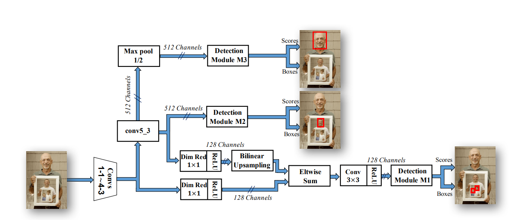
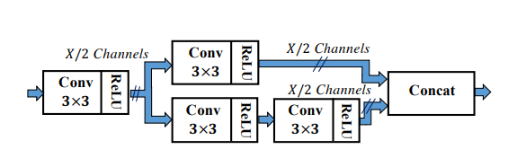
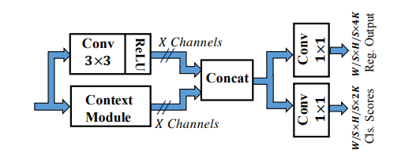
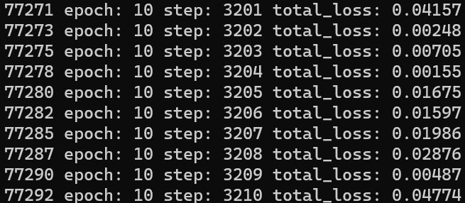
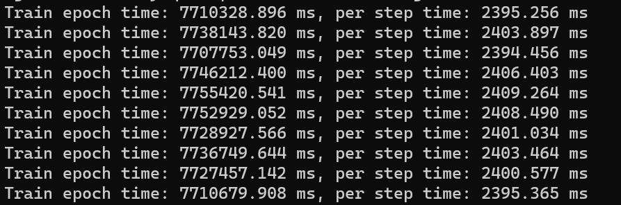
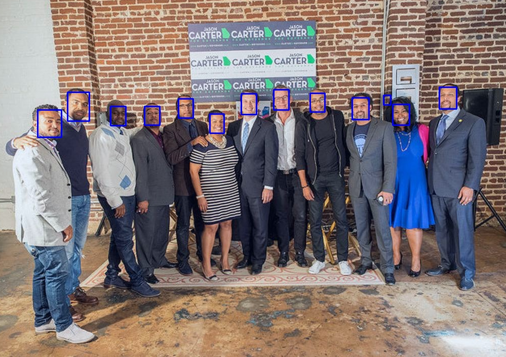

# SSH-MindSpore模型复现（mindspore框架）
mindspore版本的SSH模型，论文为SSH: Single Stage Headless Face Detector.

## 简介
SSH：Single Stage Headless Face Detector。不同于two-stages （先提供候选框然后进行分类）的检测网络，SSH是single stage的人脸检测网络，SSH直接从分类网络的前几层卷积层当中进行人脸检测。SSH网络结构是Headless的，而所谓的“Head”是指的网络参数占比较大的头模块，例如VGG16中包含大量参数的全连接层。
整体框架图如图所示。




主要包含backbone模块，Context模块和Detection模块。其中的backbone，该项目中使用的VGG16，进行特征提取。Context模块包含在Detection模块中，作用是用于增大感受野，一般在two-stage的目标检测模型当中，都是通过增大候选框的尺寸大小以合并得到更多的上下文信息，SSH通过单层卷积层的方法对上下文（context）信息进行了合并。
Context模块结构如下：


最后，Detection模块检测模块包括如下三部分：\
3✖3卷积层\
上下文网络模块\
两个1✖1输出卷积层\
首先是将3✖3卷积和上下文网络模块的输出进行concat合并，然后输入两个1✖1的卷积，分别用于人脸分类和人脸检测框修正坐标回归。Detection模型结构如下：


模型主要特点在于尺度不变性的设计，在自然场景的图像中，人脸的尺寸大小不一的。而所谓的尺度不变性则是指模型对于图像中不同尺寸大小脸的检测均具有良好的鲁棒性，很多模型检测尺寸比较大的人脸具有良好性能，然而却不能检测到尺寸小的人脸。对于这一问题，有些论文（例如MTCNN和HR）中的思路则是通过构造图像金字塔，但是其带来缺点则是运行inferrence的时候，每检测一张图像都要对该图像的构造一次图像金字塔结构，且每层的金字塔图像均进行一次前向运算，这显然是会对模型的耗时带来影响。而SSH通过在三个不同深度的卷积层feature map 上，拼接三个设计好的检测模块以检测小、中、大不同尺度的图像。

## Start

### 硬件环境与依赖库

相关的系统与硬件配置如下：

- Linux x86_64
- Ubuntu 20.04
- NVIDIA Tesla T4 (CUDA 11.1)

项目所需的主要依赖库如下：

- mindspore 1.8.1
- python 3.8


### 模型与数据集下载

1. SSH预训练模型（由TensorFlow模型权重文件转换，TF模型->.h5->.ckpt）[Google云盘](https://drive.google.com/file/d/1D2B_PueKvYpY-oMX4p2HImJaZAz6cM5f/view)

将下载的权重放到`./SSH-MindSpore`路径下。

2. 训练和测试数据集下载 [WIDER数据集官网](http://shuoyang1213.me/WIDERFACE/)
3. 训练结果模型下载 [Google云盘](https://drive.google.com/file/d/1RT5hWE1zEaOxobzpySne4a9Qj4KdV-H2/view?usp=sharing)

```
├── dataset
    └── WIDER_train
        ├── 0--Parade
            ├── xxx.jpg
            ├── yyy.jpg
            └── ...
        ├── 1--Handshaking
            ├── zzz.jpg
            ├── www.png
            └── ...
        ├── 2--Demonstration
            ├── aaa.jpg 
            ├── bbb.png
            └── ...
        └── 3--Riot
            ├── ccc.jpg 
            ├── ddd.png
            └── ...
        ...
```

### 预训练模型处理

1. 该项目的预训练模型为TensorFlow模型，首先需要利用TensorFlow环境，将模型文件转为.h5文件，可以直接使用Colab提供的TensorFlow环境即可。
```shell
python tf2h5.py --infile ./default_random_training/vgg16_ssh_iter_400000.ckpt
```

2. 得到.h5文件后，需要进一步转换为MindSpore格式的.ckpt文件。通过运行h52ckpt.py，并利用分析得到的映射关系map.csv文件，：
```shell
python h52ckpt.py
```

### 训练

1. 随机初始化权重并重新训练:

```shell
python train.py
```

2. 训练过程中会输出iteration和训练的时间、训练的loss文件loss_0.log：





训练的相关参数设置在default_config.yaml文件中。

### 测试

1. 将test文件夹下的测试文件进行人脸检测，检测结果也会保存在改文件夹下：

```shell
python test.py
```

2. 测试结果如下。



### 参考

1. Najibi M, Samangouei P, Chellappa R, et al. Ssh: Single stage headless face detector[C]//Proceedings of the IEEE international conference on computer vision. 2017: 4875-4884. [Paper](https://openaccess.thecvf.com/content_iccv_2017/html/Najibi_SSH_Single_Stage_ICCV_2017_paper.html)

2. [SSH 论文解析](https://zhuanlan.zhihu.com/p/64397468)

3. [mindspore](https://github.com/mindspore-ai/mindspore/tree/master)  

4. [mindspore 文档](https://www.mindspore.cn/tutorials/zh-CN/r1.9/index.html)

5. [Faster RCNN mindspore实现](https://gitee.com/mindspore/models/tree/master/official/cv/FasterRCNN) 

